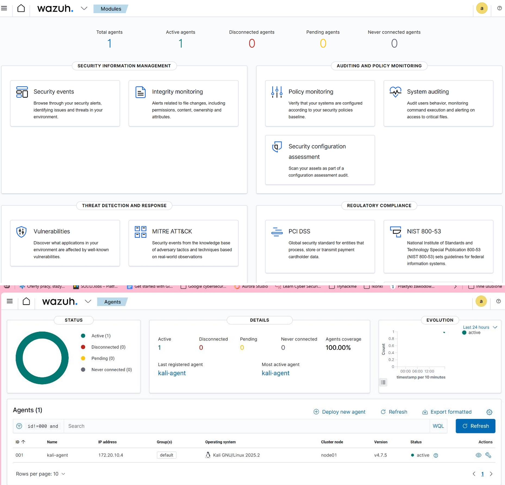
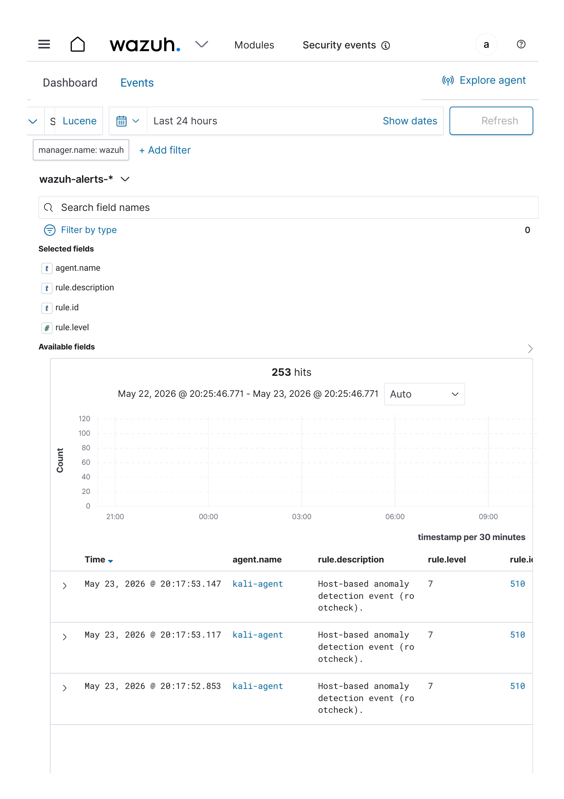
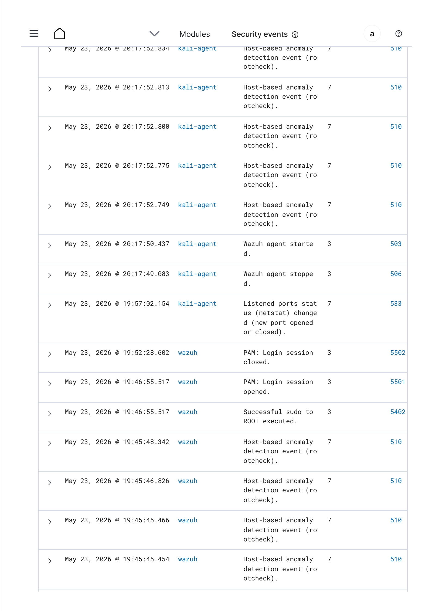
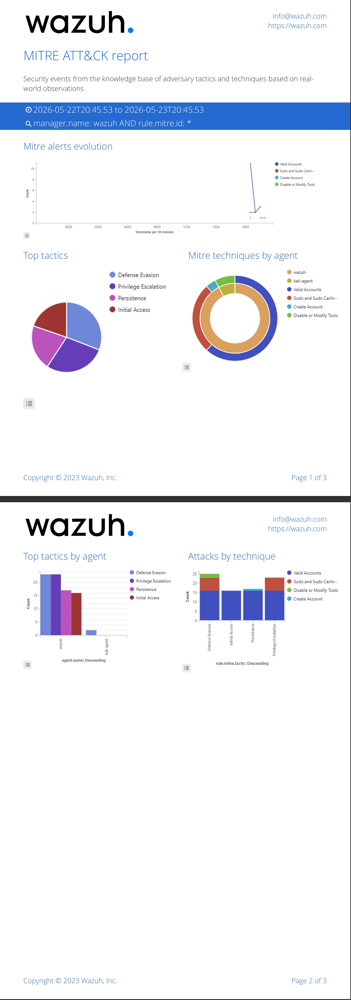

# Wazuh SIEM Laboratory

## Project Overview

This project demonstrates the deployment, configuration and operation of a Wazuh Security Information and Event Management (SIEM) platform in a virtual laboratory environment.

The laboratory was designed to simulate a basic Security Operations Center (SOC), enabling centralized log collection, endpoint monitoring, threat detection, and security event analysis using Linux endpoints.

**Goal**

Deploy and configure a Wazuh SIEM environment capable of collecting and analyzing security events from Linux endpoints.

**Environment**

- Ubuntu Server
- Kali Linux
- Oracle VirtualBox
- Wazuh SIEM

**Key Skills**

- SIEM Deployment
- Threat Hunting
- Security Monitoring
- MITRE ATT&CK
---

## Objectives

The main objectives of this project were:

- Deploy a Wazuh SIEM environment.
- Configure a Linux endpoint using the Wazuh Agent.
- Collect and monitor security events.
- Perform Threat Hunting using Wazuh.
- Analyze security events using the MITRE ATT&CK framework.
- Prepare complete technical documentation of the deployment and analysis process.

---

## Lab Environment

| Component | Description |
|-----------|-------------|
| SIEM Platform | Wazuh |
| Server OS | Ubuntu Server |
| Endpoint OS | Kali Linux |
| Virtualization | Oracle VirtualBox |
| Agent | Wazuh Agent |
| Monitoring | Security Events, Threat Hunting, MITRE ATT&CK |

---

## Technologies

- Wazuh SIEM
- Ubuntu Server
- Kali Linux
- Oracle VirtualBox
- Linux
- MITRE ATT&CK
- Threat Hunting
- Security Event Monitoring
- Security Configuration Assessment (SCA)

---

## Project Features

- Centralized security monitoring
- Endpoint log collection
- Linux endpoint monitoring
- Threat Hunting
- MITRE ATT&CK mapping
- Security event correlation
- Security Configuration Assessment (SCA)

---

## Project Workflow

The laboratory project was completed according to the following implementation workflow:

1. Deployed an Ubuntu Server virtual machine.
2. Installed and configured the Wazuh Manager.
3. Connected a Kali Linux endpoint using the Wazuh Agent.
4. Generated security events for monitoring and analysis.
5. Investigated detected alerts using the Threat Hunting module.
6. Correlated selected events with the MITRE ATT&CK framework.
7. Prepared complete technical documentation of the deployment and analysis process.
## Repository Structure

## Repository Structure

```text
wazuh-siem-lab
│
├── README.md
├── docs/
│   ├── installation.md
│   ├── agent-configuration.md
│   ├── threat-hunting.md
│   └── mitre-attack.md
├── screenshots/
└── summaries/
```

**Quick Links**

- 📄 [README.md](README.md)
- 📁 [Documentation](docs/)
  - [installation.md](docs/installation.md)
  - [agent-configuration.md](docs/agent-configuration.md)
  - [threat-hunting.md](docs/threat-hunting.md)
  - [mitre-attack.md](docs/mitre-attack.md)
- 🖼️ [Screenshots](screenshots/)
- 📝 [Summaries](summaries/)

---

## Documentation

The project documentation is organized into several sections describing the deployment, configuration, and security monitoring process.

| Document | Description |
|----------|-------------|
| **[installation.md](docs/installation.md)** | Installation and deployment of the Wazuh SIEM environment. |
| **[agent-configuration.md](docs/agent-configuration.md)** | Configuration and registration of the monitored Linux endpoint. |
| **[threat-hunting.md](docs/threat-hunting.md)** | Investigation and analysis of detected security events using Wazuh Threat Hunting. |
| **[mitre-attack.md](docs/mitre-attack.md)** | Mapping detected security events to the MITRE ATT&CK framework for attack analysis. |
---

# Project Gallery

## Wazuh Dashboard

The deployed Wazuh environment with the available security monitoring modules.



---

## Threat Hunting

Detected security events collected from the monitored Linux endpoint.



---

## Security Events

Authentication events, privilege escalation, and Rootcheck alerts detected during monitoring.



---

## MITRE ATT&CK

Security events mapped to the MITRE ATT&CK framework.



---

## Alerts Summary

Summary of generated security alerts.


---

## Project Summary

This laboratory project demonstrates the deployment, configuration and operation of a Wazuh SIEM environment in a virtual laboratory.

The completed environment enabled centralized log collection, endpoint monitoring, threat hunting, security event analysis, and MITRE ATT&CK correlation using a Linux endpoint.

The project also involved preparing technical documentation describing each implementation stage.

---

## Future Improvements

Possible future enhancements include:

- Windows endpoint monitoring
- Sysmon integration
- Active Response configuration
- YARA integration
- Sigma rule implementation
- Elastic Stack integration
- Multi-endpoint monitoring
